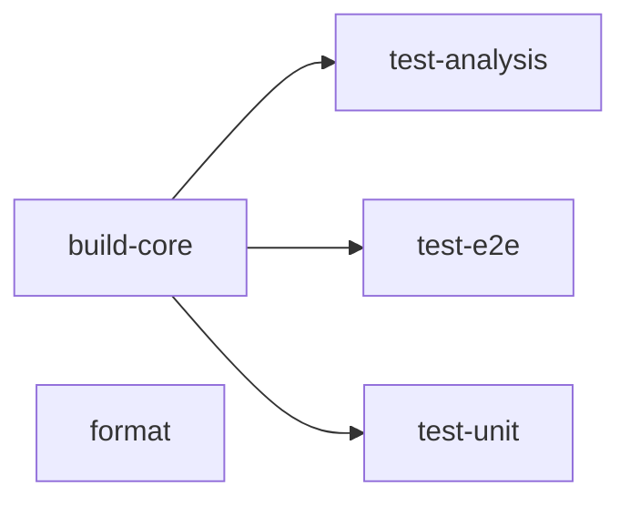
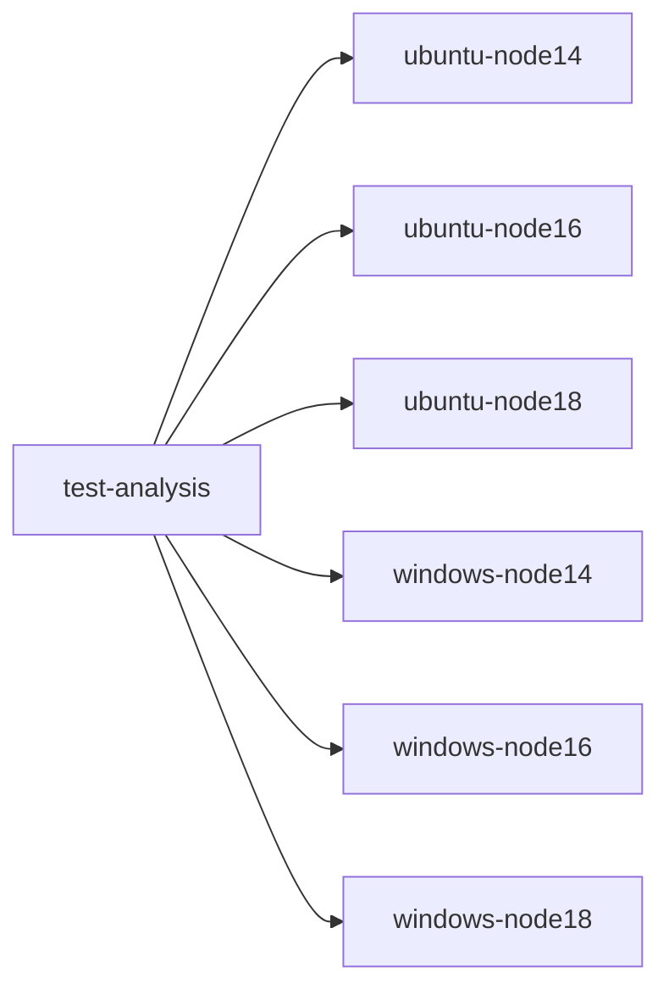

# Rindo Continuous Integration (CI)

Continuous integration (CI) is an important aspect of any project, and is used to verify and validate the changes to the
codebase work as intended, to avoid introducing regressions (bugs), and to adhere to coding standards (e.g. formatting
rules). It provides a consistent means of performing a series of checks over the entire codebase on behalf of the team.

This document explains Rindo's CI setup.

## CI Environment

Rindo's CI system runs on GitHub Actions.
GitHub Actions allow developers to declare a series of _workflows_ to run following an _event_ in the repository, or on
a set schedule.

The workflows that are run as a part of Rindo's CI process are declared as YAML files, and are stored in the same
directory as this file.
Each workflow file is explained in greater depth in the [workflows section](#workflows) of this document.

## Workflows

This section describes each of Rindo's GitHub Actions workflows.
Each of these tasks below are codified as [reusable workflows](https://docs.github.com/en/actions/using-workflows/reusing-workflows).

Generally speaking, workflows are designed to be declarative in nature.
As such, this section does not intend to duplicate the details of each workflow, but rather give a high level overview
of each one and mention nuances of each.

### Main (`main.yml`)

The main workflow for Rindo can be found in `main.yml` in this directory.
This workflow is the entrypoint of Rindo's CI system, and initializes every workflow & job that runs.

### Build (`build.yml`)

This workflow is responsible for building Rindo and validating the resultant artifact.

### Format (`format.yml`)

This workflow is responsible for validating that the code adheres to the Rindo team's formatting configuration before
a pull request is merged.

### Dev Release (`release-dev.yml`)

This workflow initiates a developer build of Rindo from the `main` branch.
It is intended to be manually invoked by a member of the Rindo team.

### Weekly Release (`release-weekly.yml`)

This workflow initiates a weekly build of Rindo from the `main` branch.
A weekly build is similar to a 'Dev Release', except that:

- it is run on a set cadence (it is not expectedthat a developer to manually invoke it)
- it is published to the npm registry under the 'weekly' tag

### Test Analysis (`test-analysis.yml`)

This workflow is responsible for running the Rindo analysis testing suite.

### Test End-to-End (`test-e2e.yml`)

This workflow is responsible for running the Rindo end-to-end testing suite.
This suite does _not_ run Rindo's BrowserStack tests.
Those are handled by a [separate workflow](#browserstack-browserstackyml).

### Test Unit (`test-unit.yml`)

This workflow is responsible for running the Rindo unit testing suite.

### Design

#### Overview

Most of the workflows above are contingent on the build finishing (otherwise there would be nothing to run against).
The diagram below displays the dependencies between each workflow.

Making each 'task' a reusable workflow allows CI to run more jobs in parallel, improving the throughput of Rindo's CI.
All resusable workflows can be found in the [workflows directory](.).
This is a GitHub Actions convention that cannot be overridden.

#### Running Tests

All test-related jobs require the build to finish first.
Upon successful completion of the build workflow, each test workflow will start.

The test-running workflows have been designed to run in parallel and are configured to run against several operating
systems & versions of node.
For a test workflow that theoretically runs on Ubuntu and Windows operating systems and targets Node v14, v16 and v18, a
single test workflow may spawn several jobs:

These 'os-node jobs' (e.g. `ubuntu-node16`) are designed to _not_ prematurely stop their sibling jobs should one of
them fail.
This allows the opportunity for the sibling test jobs to potentially pass, and reduce the number of runners that need to
be spun up again should a developer wish to 're-run failed jobs'.
Should a developer feel that it is more appropriate to re-run all os-node jobs, they may do so using GitHub's 're-run
all jobs' options in the GitHub Actions UI.

#### Concurrency

When a `git push` is made to a branch, Rindo's CI is designed to stop existing job(s) associated with the workflow +
branch.
A new CI run (of each workflow) will begin upon stopping the existing job(s) using the new `HEAD` of the branch.

## Repository Configuration

Each of the workflows described in the [workflows section](#workflows) of this document must be configured in the
Rindo GitHub repository to be _required_ to pass in order to land code in the `main` branch.
